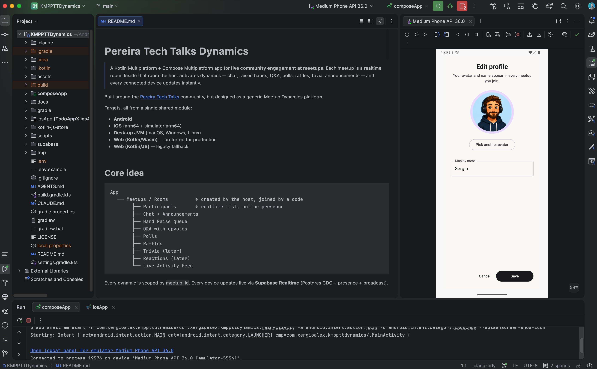

# Pereira Tech Talks Dynamics

> A Kotlin Multiplatform + Compose Multiplatform app for **live community
> engagement at meetups**. Each meetup is a realtime room. Inside that room
> the host activates dynamics — chat, raised hands, Q&A, polls, raffles,
> trivia, announcements — and every connected device updates instantly.

Built around the [Pereira Tech Talks](https://pereiratechtalks.com)
community, but designed as a generic Meetup Dynamics platform.



Targets, all from a single shared module:

- **Android**
- **iOS** (arm64 + simulator arm64)
- **Desktop JVM** (macOS, Windows, Linux)
- **Web (Kotlin/Wasm)** — preferred for production
- **Web (Kotlin/JS)** — legacy fallback

## Core idea

```
App
  └── Meetups / Rooms          ← created by the host, joined by a code
        ├── Participants       ← realtime list, online presence
        ├── Chat + Announcements
        ├── Hand Raise queue
        ├── Q&A with upvotes
        ├── Polls
        ├── Raffles
        ├── Trivia (later)
        ├── Reactions (later)
        └── Live Activity Feed
```

Every dynamic is scoped by `meetup_id`. Every device updates live via
**Supabase Realtime** (Postgres CDC + presence + broadcast).

## Current milestones

| Milestone | Status |
|---|---|
| **M1 — Rooms + Participants + realtime foundation** | ✅ Implemented |
| **M2 — Chat + Announcements**                        | ✅ Implemented |
| **M3 — Raise hand + Q&A**                            | ✅ Implemented |
| **M4 — Polls**                                       | ✅ Implemented |
| **M5 — Raffles**                                     | ✅ Implemented |
| M6 — Host dashboard polish, projection-friendly views | ⏳ Planned |
| M7+ — Trivia, reactions, leaderboard, QR check-in, Supabase Auth, hardened RLS, Edge Functions, analytics | ⏳ Planned |

What works today:

- **Rooms**: create meetup with a generated 6-char join code, list live + past meetups, join by code or by tapping a meetup, host start/pause/end
- **Participants**: pick a display name, optionally elevate to host, realtime online/offline indicator
- **Chat**: per-room realtime chat, host announcements (highlighted), host hide-message moderation
- **Hand raise**: participant raise/lower with optional context, host queue with acknowledge / speaking / lower / dismiss states
- **Q&A**: ask, upvote (one vote per participant via DB unique index), host mark-answered + hide, sorted by upvotes
- **Polls**: host create with 2–6 options + anonymous toggle, single-choice vote (revoting overrides), realtime tally with progress bars, host close
- **Raffles**: host create, participants enter (or host enrolls everyone), host draws a random winner with an animated reveal that propagates to every device

The room is a `PrimaryScrollableTabRow` with tabs **Live · ✋ · Chat · Q&A · Polls · Raffles**. Each tab subscribes to its own Supabase Realtime channel scoped by `meetup_id`.

## Tech stack

| What | Version | Why |
|---|---|---|
| Kotlin Multiplatform | 2.3.20 | Shared language across all targets |
| Compose Multiplatform | 1.10.3 | Shared declarative UI on every target |
| Material 3 | 1.10.0-alpha05 | Design system |
| AndroidX Lifecycle (KMP) | 2.10.0 | `ViewModel` + `viewModelScope` in `commonMain` |
| **supabase-kt** | 3.6.0 | Postgrest queries + Realtime subscriptions |
| Ktor client | 3.0.3 | Transport layer for supabase-kt (CIO / Darwin / JS engines) |
| kotlinx-serialization | 1.7.3 | JSON for Postgrest payloads |
| kotlinx-coroutines | 1.10.2 | Realtime flows + structured concurrency |
| BuildKonfig | 0.17.1 | Generates a multiplatform `BuildConfig` from `.env` values |
| multiplatform-settings | 1.2.0 | Theme + last-used display name persistence |
| Compose Hot Reload | 1.0.0 | Live reload while iterating on Desktop |

Full catalog: [`docs/TECHNOLOGIES.md`](docs/TECHNOLOGIES.md).

## Supabase setup

The app needs a Supabase project. The migration script provisions every
table the milestones need (meetups, participants, chat, hand raises,
questions, polls, raffles, activity events, plus realtime publication
and a permissive RLS baseline).

### 1. Create a Supabase project

Sign up at [supabase.com](https://supabase.com) and create a project in
the Americas region. Note your project ref (the random subdomain in the
project URL) and database password.

### 2. Configure `.env`

```bash
cp .env.example .env
```

Fill in:

| Variable | Where to get it | Used by |
|---|---|---|
| `SUPABASE_URL` | Project Settings → API → Project URL | client (BuildKonfig) |
| `SUPABASE_PUBLISHABLE_KEY` | Project Settings → API → `anon` / publishable key | client (BuildKonfig) |
| `SUPABASE_PROJECT_REF` | The subdomain in your project URL | `scripts/supabase_apply.sh` |
| `SUPABASE_DB_PASSWORD` | The password you set when you created the project | `scripts/supabase_apply.sh` |
| `SUPABASE_DB_URL` *(optional, recommended)* | Project Settings → Database → **Session pooler** | `scripts/supabase_apply.sh` (overrides the previous two; pooler URL works on every network) |
| `SUPABASE_ACCESS_TOKEN` *(optional)* | Account → Access Tokens | `supabase` CLI |
| `SUPABASE_SECRET_KEY` *(optional)* | Project Settings → API → service_role key | trusted backend scripts only |

> **Trust boundaries.** `SUPABASE_URL` + `SUPABASE_PUBLISHABLE_KEY` ship
> inside every client and are gated by Row Level Security. Everything
> else (`ACCESS_TOKEN`, `DB_PASSWORD`, `SECRET_KEY`) is **CLI-only** —
> never reference it from `commonMain`, app resources, or any code that
> ends up in a release artifact. `BuildKonfig` is wired to read **only**
> the first two; the others stay in `.env` and on developer laptops.

### 3. Apply the schema

```bash
./scripts/supabase_apply.sh
```

This runs every file in `supabase/migrations/` against the database via
`psql`. Re-runs are safe — every statement is idempotent.

> **Networking gotcha.** Supabase's direct host `db.<ref>.supabase.co`
> publishes only an IPv6 address. On macOS, `getaddrinfo()` sometimes
> refuses AAAA-only records even when IPv6 routing is fine, breaking
> `psql`. The script auto-falls back to the literal IPv6, but the
> proper fix is to set `SUPABASE_DB_URL` to the **Session Pooler** URL
> (`Project Settings → Database → Session pooler`). It's IPv4+IPv6 and
> works on every dev network.

> **`psql` not on PATH?** Homebrew's `libpq` is keg-only. The script
> auto-detects `/opt/homebrew/opt/libpq/bin/psql`; for a permanent fix
> run `brew link --force libpq`.

The first migration creates:

- All tables (`meetups`, `meetup_participants`, `chat_messages`,
  `raised_hands`, `questions`, `question_votes`, `polls`, `poll_options`,
  `poll_votes`, `raffles`, `raffle_entries`, `raffle_winners`,
  `activity_events`, plus an optional `profiles` shell for future auth)
- A trigger that keeps `questions.upvotes_count` in sync with the
  `question_votes` table
- A unique partial index that prevents two active raised hands per
  participant
- All these tables added to the `supabase_realtime` publication so
  Postgres-changes subscriptions deliver inserts / updates / deletes
- **Permissive MVP RLS policies** that let the anon role read and write
  freely. **Tighten before production** — search for `WARNING:` in the
  SQL file.

### 4. Build & run

```bash
./gradlew :composeApp:run                          # Desktop (hot reload)
./gradlew :composeApp:installDebug                 # Android emulator/device
./gradlew :composeApp:wasmJsBrowserDevelopmentRun  # Web (Wasm — preferred)
./gradlew :composeApp:jsBrowserDevelopmentRun      # Web (JS — legacy)
# iOS: open iosApp/iosApp.xcodeproj in Xcode and ⌘R
```

> ⚠️ Build with **Java 21**. Gradle 8.14 doesn't recognise newer JDKs.
> ```bash
> export JAVA_HOME="$(/usr/libexec/java_home -v 21)"
> ```

If `.env` is missing or its keys are blank, the app boots into a friendly
"Supabase not configured" screen that points back here.

## Architecture at a glance

```
commonMain                  domain/        ← Meetup, MeetupParticipant, ParticipantRole, MeetupStatus
                            supabase/      ← SupabaseClientProvider (lazy, BuildKonfig-driven)
                            meetups/       ← MeetupRepository  (REST + realtime channel)
                            participants/  ← ParticipantRepository (REST + realtime channel)
                            ui/{home,create,join,room,theme,components}
                                ▲
                                │ injected via
                                │
                            AppContainer   ← built once at each platform entry point
```

- All UI, view models, repositories, and the domain model live in
  `commonMain` — no per-platform clones.
- Each platform main wires `AppSettings` (multiplatform-settings) and
  hands the container to `App()`.
- Supabase config flows in via a `BuildConfig` Kotlin object that
  BuildKonfig generates at build time from `.env`.

Full write-up: [`docs/ARCHITECTURE.md`](docs/ARCHITECTURE.md).

## Realtime model

Every repository that powers a live UI exposes a `Flow<…>` that:

1. Subscribes to the matching `supabase_realtime` channel filtered by
   `meetup_id`.
2. Emits an initial REST snapshot.
3. Re-emits a fresh snapshot on every Postgres change.
4. Unsubscribes the channel when the flow is cancelled.

`MeetupRepository.observeAll()` powers the home screen.
`ParticipantRepository.observe(meetupId)` powers the room.

When chat / hand raise / Q&A / polls / raffles land in the next
milestones, each will follow the same pattern.

## Project layout

```
composeApp/
└── src/
    ├── commonMain/kotlin/com/xergioalex/kmppttdynamics/
    │   ├── App.kt
    │   ├── AppContainer.kt
    │   ├── JoinCodeGenerator.kt
    │   ├── domain/                 # Meetup, MeetupParticipant, etc.
    │   ├── supabase/               # SupabaseClientProvider
    │   ├── meetups/                # MeetupRepository
    │   ├── participants/           # ParticipantRepository
    │   ├── settings/AppSettings.kt # theme + last display name
    │   └── ui/{home,create,join,room,theme,components}
    ├── commonMain/composeResources/
    │   ├── drawable/{ptt_logo_vertical.png, ptt_logo_horizontal.png}
    │   ├── values/strings.xml      # English
    │   └── values-es/strings.xml   # Spanish
    ├── commonTest/                 # kotlin.test
    ├── androidMain/                # MainActivity, Platform.android.kt, launcher icons
    ├── iosMain/                    # MainViewController, Platform.ios.kt
    ├── jvmMain/                    # main.kt + Platform.jvm.kt
    ├── webMain/                    # ComposeViewport entry shared by JS + Wasm
    ├── jsMain/Platform.js.kt
    └── wasmJsMain/Platform.wasmJs.kt

iosApp/                             # Xcode project consuming the ComposeApp framework
supabase/migrations/                # Idempotent SQL (apply with scripts/supabase_apply.sh)
scripts/supabase_apply.sh
.env.example                         # Template — copy to .env (gitignored)
gradle/libs.versions.toml            # Single version catalog
docs/                                # Architecture, platforms, testing, etc.
assets/pereiratechtalks/             # Source logos used for branding
```

## Documentation

| Topic | File |
|---|---|
| Architecture & source sets | [`docs/ARCHITECTURE.md`](docs/ARCHITECTURE.md) |
| App overview & feature roadmap | [`docs/APP_OVERVIEW.md`](docs/APP_OVERVIEW.md) |
| Stack and versions | [`docs/TECHNOLOGIES.md`](docs/TECHNOLOGIES.md) |
| Coding standards | [`docs/STANDARDS.md`](docs/STANDARDS.md) |
| Gradle commands | [`docs/DEVELOPMENT_COMMANDS.md`](docs/DEVELOPMENT_COMMANDS.md) |
| Testing | [`docs/TESTING_GUIDE.md`](docs/TESTING_GUIDE.md) |
| Per-platform notes | [`docs/PLATFORMS.md`](docs/PLATFORMS.md) |
| Build & deploy | [`docs/BUILD_DEPLOY.md`](docs/BUILD_DEPLOY.md) |
| Internationalization | [`docs/I18N_GUIDE.md`](docs/I18N_GUIDE.md) |
| Performance | [`docs/PERFORMANCE.md`](docs/PERFORMANCE.md) |
| Accessibility | [`docs/ACCESSIBILITY.md`](docs/ACCESSIBILITY.md) |
| Security & RLS | [`docs/SECURITY.md`](docs/SECURITY.md) |
| AI agent onboarding | [`docs/AI_AGENT_ONBOARDING.md`](docs/AI_AGENT_ONBOARDING.md) |

## Roadmap

- [x] **M1** Rooms + participants + realtime
- [x] **M2** Chat + announcements
- [x] **M3** Raise hand + Q&A
- [x] **M4** Polls
- [x] **M5** Raffles
- [ ] **M6** Host dashboard polish (projection mode, dark theme audit)
- [ ] **M7+** Trivia, reactions, leaderboard, QR check-in, Supabase Auth, hardened RLS, Edge Functions for fair raffle draws, analytics, event-history exports

## Production safety notes

This project is currently a **demo / community tool**, not a hardened
product. Document and tighten before public deployment:

- **RLS policies are permissive.** Anyone with the anon key can insert
  into any meetup. Add per-row checks (host-only writes for
  `meetups.status`, host-only inserts for `polls`, etc.).
- **Anonymous participants** make abuse easy. Layer Supabase Auth on top
  before opening to public meetups.
- **Raffle draws happen on the host client** today. For fairness, move
  the draw into a Supabase Edge Function or SQL function so the host can't
  re-roll.
- **Chat has no rate limiting or moderation tooling.** Add both.
- **Presence is ephemeral.** Don't rely on `is_online` for billing,
  attendance, or anything that needs an auditable record.

## Project history

This repository started as [`xergioalex/kmpstarter`](https://github.com/xergioalex/kmpstarter),
became a Todo demo at [`xergioalex/kmptodoapp`](https://github.com/xergioalex/kmptodoapp),
and is now Pereira Tech Talks Dynamics. The KMP plumbing (source sets,
target list, build config, Compose resources, hot reload) is inherited
from those iterations.

## License

Released under the [MIT License](LICENSE).

## Credits

- KMP / Compose Multiplatform foundations from JetBrains.
- Supabase Kotlin client by [`@jan-tennert`](https://github.com/jan-tennert) and contributors.
- Logos and brand by the [Pereira Tech Talks](https://pereiratechtalks.com) community.
